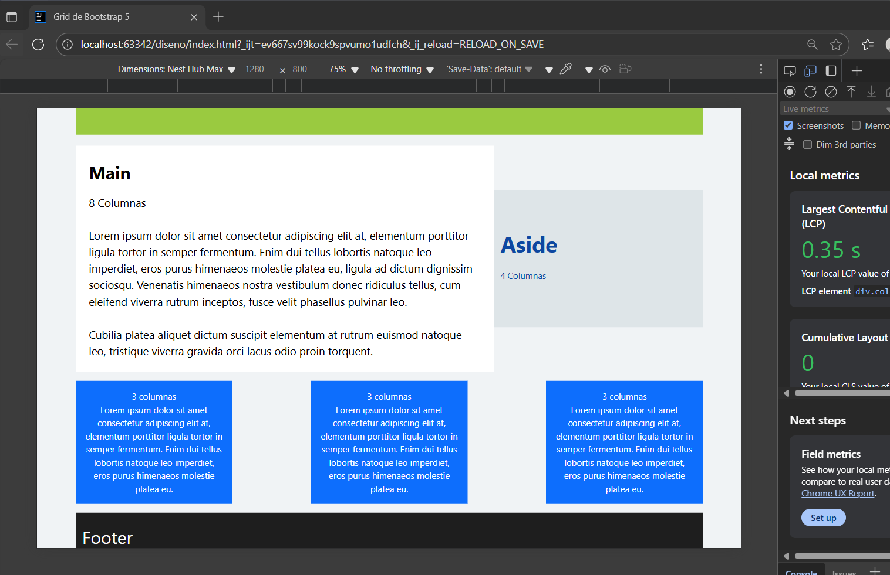

# Boostrap
# Integrantes del grupo
Alexis Castellon Fernandez  
Jose Luis Fernandez Cabeza

# Explicacion del proyecto

El objetivo del proyecto es una actividad realizada en clase para la iniciacion
en Boostrap. Practicando container rows y cols. Apoyandose en css.

# Descripcion de la estructura

Se compone por un container que engloba todo el contenido y dividimos
con rows(Un Header de 12 columnas, Un main de 8 columnas, un Aside de 4 columnas
, 3 Bloques de texto de 3 columnas cda uno alineados y separados equitativamente, 
y un Footer de 12 columnas)

# Captura de pantalla
Pantalla completa

Pantalla reducida

Pantalla Iphone 12 Pro

Pantalla Tablet
